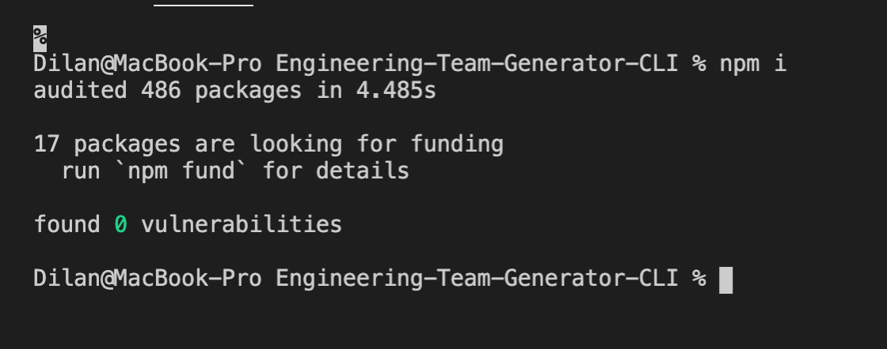
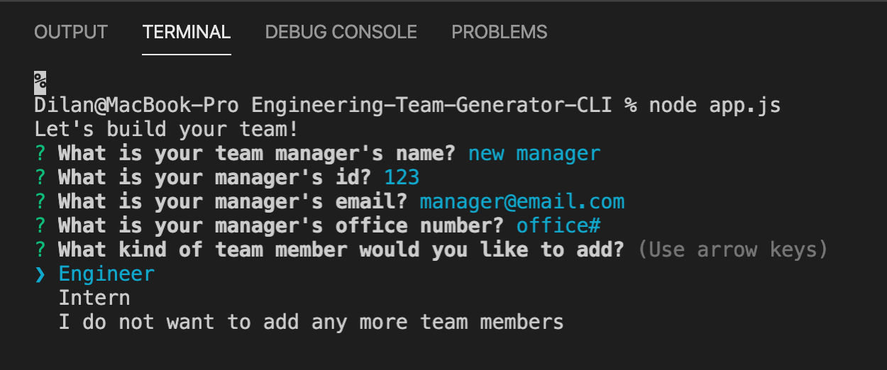

# Engineering-Team-Generator-CLI

## Description
The Engineering Team Generator is a command line app that helps companies to display their employee information in a systematic and visual manner. The user will be able to enter individual employee information such as name, id, email, etc. They can also enter as many employees as they want. Upon finishing entering employee information, all recorded info will be generated onto a html under a nicely formatted card display.  

  

## Installation
- clone the repository onto your computer
- open the terminal in the root directory, install necessary packages by running the **npm i** command

  

## Usage
- initiate the app by running **node app.js** in the terminal under root directory
- enter employee information accordingly, when finished, choose "I do not want to add any more team members"
- your employee website will be generated within the "output" folder, under file name "team.html"

  

## Video Demo
For a more elaborate walk through of installation and usage of the app, click on the video demo below:  

## Tests
This app is made under Test Driven Development, all tests have passed. If you would like to do any tests on your own, open terminal under the "test" directory, and run **npm test**, make sure required npm packages are installed before running tests

  

## Credit
Thank you for the email validate function:   
GitHub: Amitabh-K  
https://gist.github.com/Amitabh-K/ae073eea3d5207efaddffde19b1618e8